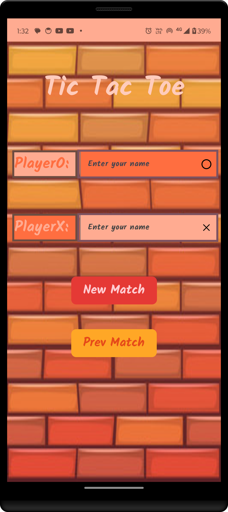
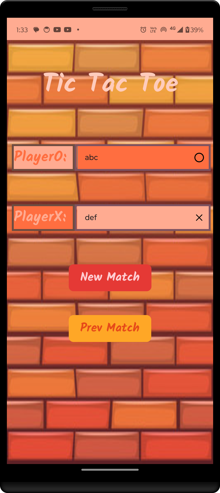
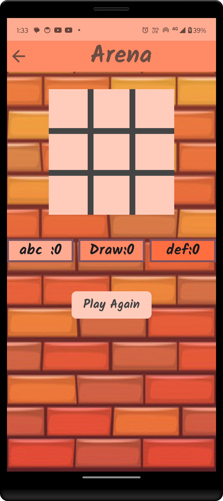
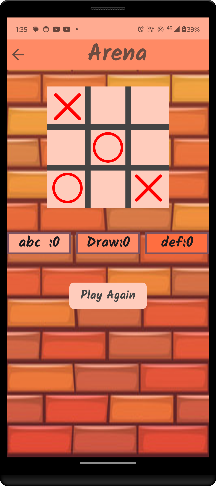
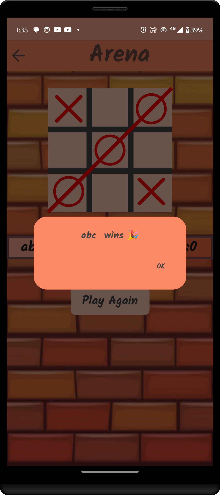
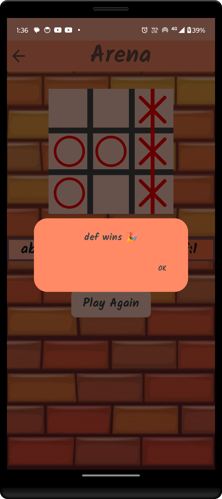
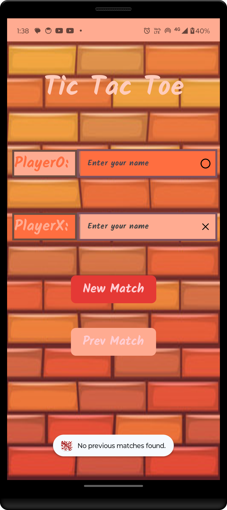

# TicTacToe

A simple and fun TicTacToe game for Android, developed using Kotlin with Android Studio.

## Table of Contents

- [Introduction](#introduction)
- [Features](#features)
- [Screenshots](#screenshots)
- [Installation](#installation)
- [Usage](#usage)
- [Contributing](#contributing)
- [License](#license)
- [Contact](#contact)

## Introduction

Welcome to the TicTacToe Android game! This is a straightforward implementation of the classic TicTacToe game where two players take turns marking spaces in a 3×3 grid. The objective is to be the first to place three of your marks in a row (horizontally, vertically, or diagonally).

## Features

- Simple and intuitive user interface
- Two-player mode
- Reset functionality to start a new game
- Highlights the winning line

## Screenshots

<div>







</div>

## Installation

To run this project on your local machine, follow these steps:

1. **Clone the repository:**
    ```sh
    git clone https://github.com/Rahula-12/TicTacToeGame.git
    ```

2. **Open the project in Android Studio:**
    - Launch Android Studio
    - Select `Open an existing project`
    - Navigate to the cloned repository's folder and select it

3. **Build the project:**
    - Android Studio will download all necessary dependencies and build the project

4. **Run the project:**
    - Connect your Android device or start an emulator
    - Click the `Run` button in Android Studio

## Usage

1. **Launch the app** on your Android device.
2. **Start a game** by entering names of players and clicking the **New Match** button.
3. **Alternate turns** between Player X and Player O by tapping on the desired cells.
4. **Winning and Draw:** The game will display a message indicating the winner or a draw when the game ends.

## Contributing

We welcome contributions to enhance this game! Here’s how you can contribute:

1. **Fork the repository**
2. **Create a new branch** for your feature or bugfix (`git checkout -b feature-branch`)
3. **Make your changes**
4. **Commit your changes** (`git commit -m 'Add new feature'`)
5. **Push to the branch** (`git push origin feature-branch`)
6. **Create a Pull Request**

## License

This project is licensed under the MIT License. See the [LICENSE](LICENSE) file for more information.

## Contact

If you have any questions, suggestions, or feedback, feel free to reach out:

- Email: ra9853044@gmail.com
- GitHub: [Rahula-12](https://github.com/Rahula-12)

---

Thank you for checking out the TicTacToe Android game project! Enjoy playing!
