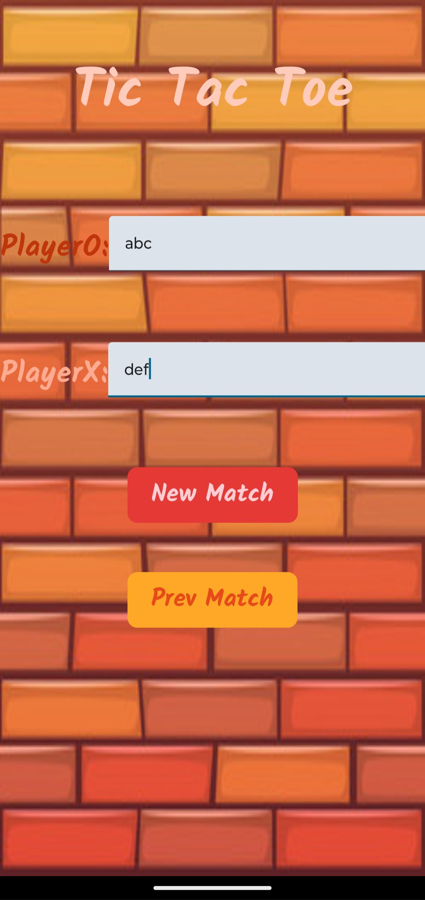
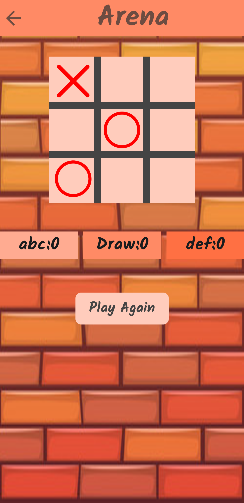
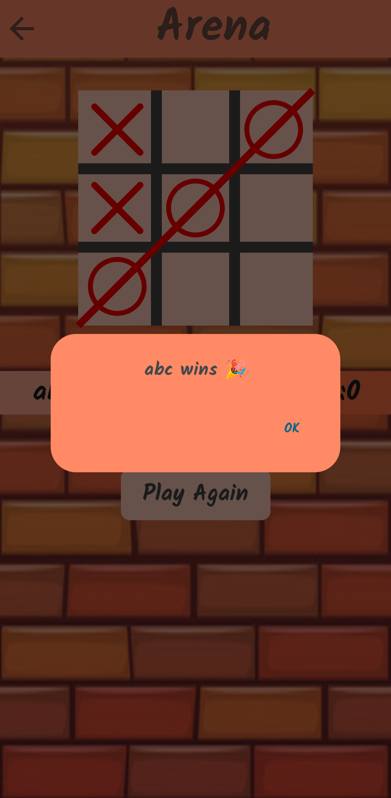
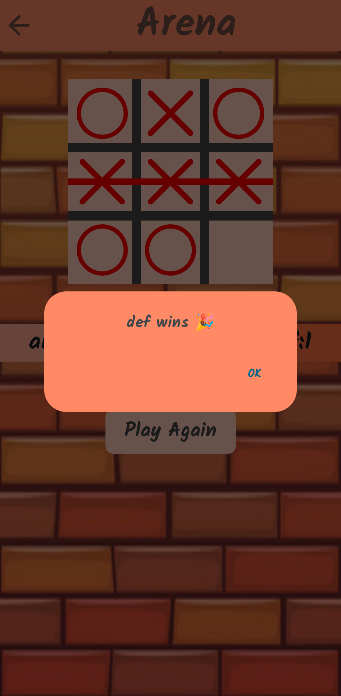
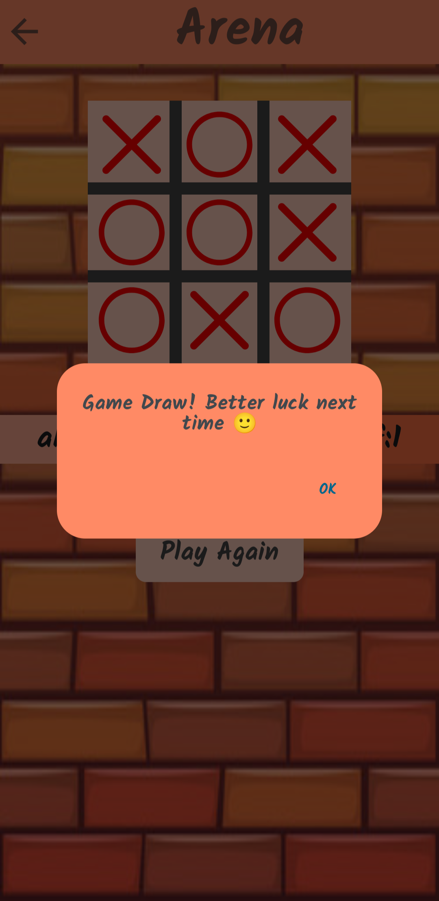

# TicTacToeGame

# About
This project is a simple implementation of the classic Tic Tac Toe game for Android devices. It allows players to engage in a game of Tic Tac Toe against each other on their mobile phones or tablets.

# Features
Allows players to start a new match or continue their previous match.

# Tools Used
1. Android Studio IDE
2. MVVM Architecture
3. Hilt and Dagger
4. Room Database Library

# Installation
You can install this application to test on your android smartphone. To download the signed application go to your chrome browser and copy-paste the download link:

https://github.com/Rahula-12/TicTacToeGame/releases/download/latest/TicTacToe.apk

Download will be started automatically. After then install it on your android device. Open the application, enjoy the game. That's it.

N.B: It supports only in android version 7.0 or later.

# Preview

# Contributing
Contributions are welcome! If you'd like to contribute to this project, please follow these guidelines:

Fork the repository and create a new branch.
Make your changes and test them thoroughly.
Submit a pull request detailing the changes you've made.

# License
This project is licensed under the MIT License.

# Acknowledgements
This project was inspired by TicTacToe game.

